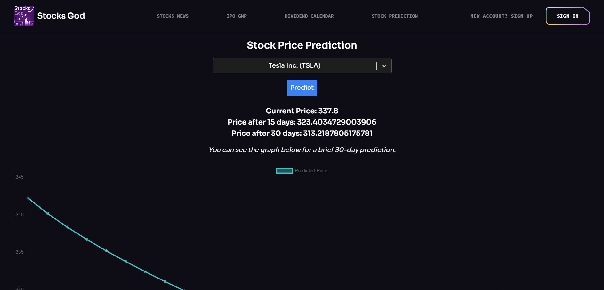

# StocksGod

StocksGod is a stock market platform designed for investors and traders to stay updated with real-time stock news, IPO GMP analysis, dividend calendars, and stock price predictions. Our platform helps users make informed decisions with AI-powered insights.

## Features

- **Fastest News**: Stay ahead of the market with real-time stock news.
- **IPO GMP Analysis**: Get the latest Grey Market Premium insights.
- **Dividend Calendar**: Track upcoming dividend record dates.
- **Stock Price Prediction**: LSTM-based deep learning model for stock price forecasting.
- **Personalized Investment Advice**: Tailored recommendations for better decision-making.

### Preview




## Tech Stack

- **Frontend**: React, JavaScript, Vite
- **Backend**: Flask, Python
- **Machine Learning**: LSTM Neural Networks (TensorFlow, Keras)
- **Database & APIs**: Tiingo API, Firebase
- **Deployment**: Netlify

## Live Demo 🌍  

Check out the live version of **StocksGod** here:  
👉 [StocksGod Live](stocksgod.live)  

## ⚠️ Current Deployment Status

The backend is currently **not deployed** due to compatibility issues with TensorFlow and CUDA on the deployment server. 
This is causing errors related to missing GPU drivers as TensorFlow is unable to detect CUDA drivers, leading to CPU fallback.

## LSTM Model for Stock Prediction

We have implemented an LSTM (Long Short-Term Memory) model for stock price prediction. The model is trained on historical stock price data and provides forecasts for the next 30 days.

### Prediction Results

- **Current Stock Price**: 337.8 (Example of Tesla Inc.)
- **Predicted Price After 15 Days**: 323.4 
- **Predicted Price After 30 Days**: 313.21 

The LSTM model helps users get an idea of future stock price trends, enhancing decision-making.

## 🚀 Future Enhancements  

### Stock Market Sentiment Analysis using Tweets  

We are currently working on integrating a **Sentiment Analysis Model** using Twitter/X data to predict market trends based on investor sentiment.  

📌 **What’s Planned?**  

- Scrape Twitter/X data related to stock symbols (e.g., `$TSLA`, `$AAPL`).  
- Use **Hugging Face Transformers** (BERT, FinBERT) to analyze sentiment.  
- Predict whether **positive sentiment → stock price increase** and **negative sentiment → price drop**.  
- **Bonus:** Use LSTM to correlate sentiment with stock prices.  

## Setup Instructions

1. Clone the repository:
   ```sh
   git clone https://github.com/yourusername/StocksGod.git
   cd StocksGod
   ```
2. Install dependencies:
   ```sh
   pip install -r requirements.txt
   ```
3. Run the backend:
   ```sh
   python app.py
   ```
4. Start the frontend:
   ```sh
   npm install
   npm run dev
   ```

## Contributing

We welcome contributions! Feel free to submit issues or create pull requests.

## License

MIT License © 2025 StocksGod Team

